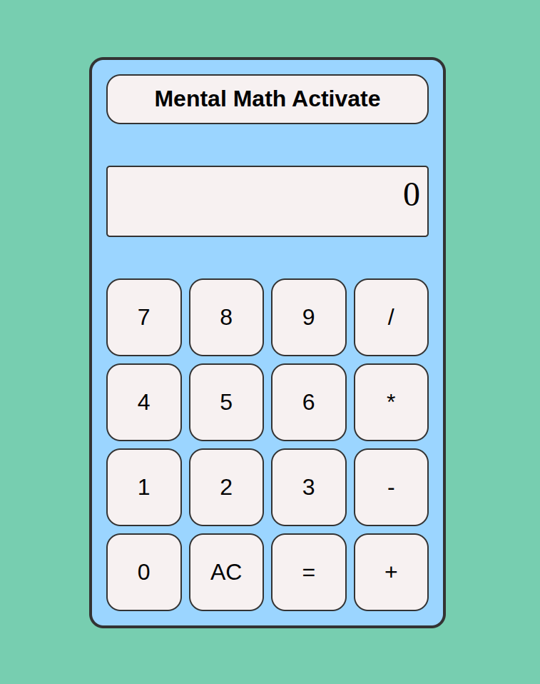

# The Classic Calculator App (With a Twist!)

  

The calculator application with a mental math option

## Features

- Can perform basic arithmetic of integers
- Handles division by zero
- Handles chained calculations

## Fun Feature: Toggle button to enable a mental math option!

- Here, the user has 5 seconds to think of the solution to their calculation before the correct answer is displayed.
- All buttons, except the button to toggle back to regular mode, are disabled for the 5 second count down.